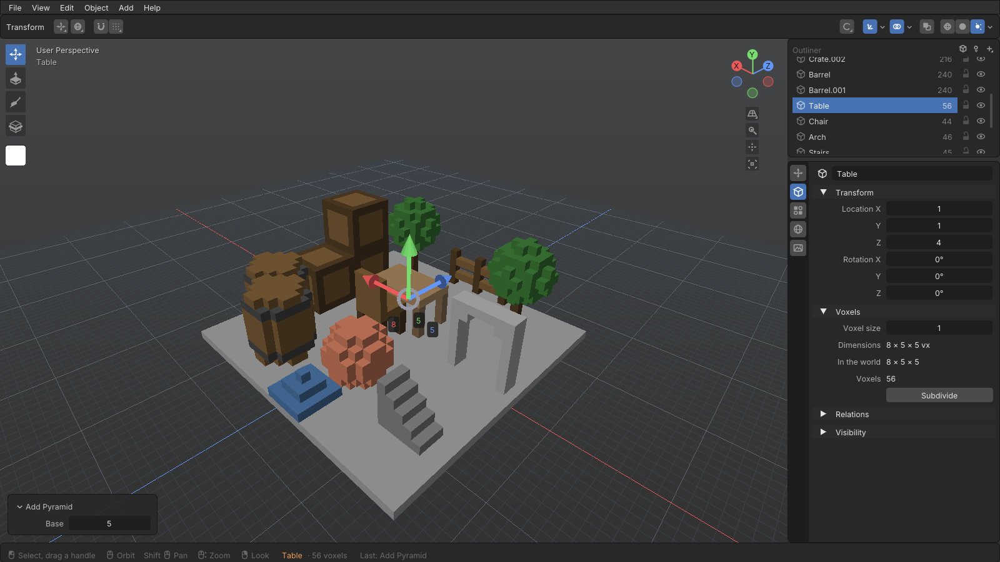
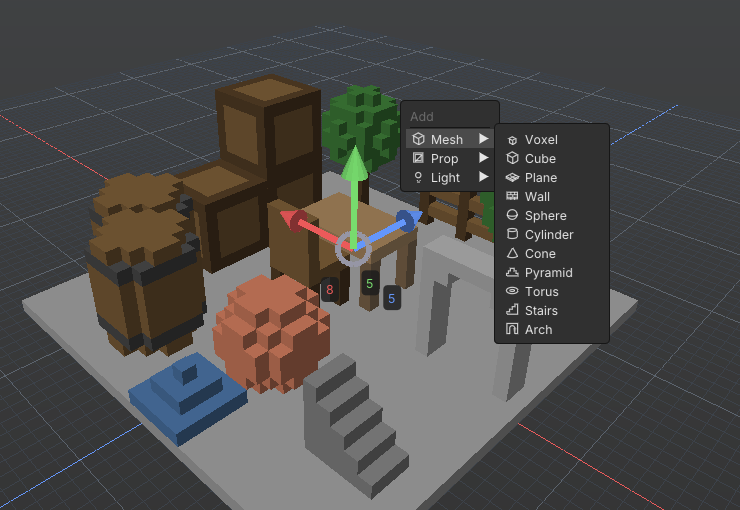

<p align="center">
  
</p>

# Blockage

**A voxel level editor with Blender's habits.** You shape volume by pulling faces out and pushing
them in — there is no place-a-block tool — then paint faces, cut objects in two, parent, light, and
export clean meshes for a game engine.

It grew out of the level and prop pipeline for the game *Mimic Busters*, and writes that game's
`.character` and `.weapons` files as well as OBJ and glTF.

> **Status: early — 0.7 in development.** In daily use, but expect rough edges, and file-format
> changes before 1.0. The downloads below are still the 0.1.0 release.

## Download

Get the latest build from [**Releases**](https://github.com/koronerap/Blockage/releases).

| Platform | File | Notes |
|---|---|---|
| Windows 10/11, x64 | `Blockage-0.1.0-win-x64.zip` | Unzip and run `Blockage.exe`. No .NET install needed. The build is not code-signed, so SmartScreen may stop it the first time: **More info → Run anyway**. |
| macOS, Apple Silicon | `Blockage-0.1.0-osx-arm64.tar.gz` | **Experimental: built, but not yet run on a Mac.** Unpack, clear the download quarantine with `xattr -dr com.apple.quarantine Blockage-0.1.0-osx-arm64`, and start `./Blockage` from a terminal inside it. |
| Android 8+ | `Blockage-0.1.0-android.apk` | Sideload it. A lighter companion on the same core: the four tools, the palette, undo, open and save. |

## What it does

- **Shape by extruding.** Drag across a surface to select it — a box, or a whole flat patch in one
  click — then pull the arrow out to add voxels or push it in to carve. Loop Cut splits an object in
  two along a plane.
- **Objects as a whole.** Select by click or box, as in Blender; a Transform gizmo that moves the
  whole selection, with Blender-style snapping (increments, corners, edge centres, surfaces) and a
  choice of pivot; parenting and joining into the active object, duplicate, subdivide, quarter turns
  and mirrors, hide and lock.
- **Inside an object.** Tab into Edit Mode to choose voxels - by click, box, magic wand or colour -
  move and turn them on the object's lattice, separate them with P, fill or delete them.
- **Sculpt, carve and combine.** A Sculpt tool for terrain and anything organic (build up, carve,
  raise, lower, flatten, smooth); boolean union, difference and intersection; hollow, thicken, thin,
  clean up loose pieces, halve the resolution or scale a model.
- **Non-destructive modifiers.** Mirror and Array, shown and exported over the voxels you edit, to
  switch off, change or apply at any time.
- **Paint face by face.** Brush, bucket and pattern fills; gradient, noise and dither in two colours;
  a stencil that lays an image over the view; an eyedropper on Alt; replace a colour everywhere or
  shift hue, saturation and value.
- **A palette with materials.** 256 colours, each with its own glow, metal, roughness and glass, shown
  in the viewport and exported to glTF; palettes in and out as .gpl, .hex and .png (Lospec's too),
  ramps, and a library of palettes.
- **Lay out levels.** Nested collections with show, lock and export switches; linked copies (Alt+D)
  that share their voxels and export to glTF as one mesh; a prop library of your own, and Append from
  other levels; align and distribute; scatter trees and rocks over the ground; markers (spawn points,
  triggers, sounds) and custom properties, sent to the game in glTF extras; and generated terrain,
  caves, trees, rocks and buildings.
- **Render.** A path tracer for presentation pictures: soft shadows, light bounced off walls, glowing
  colours, metal and glass, sky light, fog, bloom and depth of field. It runs on every CPU core, or
  on the graphics card where OpenGL 4.3 is available, and both give the same picture. F12 renders an
  image to save as a PNG, see-through if you like. A fourth, *Rendered* shading clears in the
  viewport while the view is still. Cameras (perspective, orthographic or isometric) are kept with
  the level; look through one with Numpad 0. Turntables can be saved as GIF, PNGs or MP4 (with
  ffmpeg), and sprite sheets from any number of angles.
- **Add with Shift+A.** Cubes, spheres, cylinders, cones, stairs, arches, voxel lettering and more;
  ready-made props — crates, barrels, tables, trees — and lights, set down on the surface under the
  cursor and sized afterwards in an *Adjust* panel; cameras, where the view stands.
- **Blender where it helps.** F3 command search, a right-click context menu, overlays, X-Ray and
  wireframe, an Outliner with hierarchy, rebindable keys (a *Default* and a *Mimic Busters* preset), a
  welcome screen with templates.
- **Export.** OBJ and glTF/GLB, greedy-meshed, with a generated palette texture and automatic UVs;
  Mimicraft `.character` and `.weapons`.
- **Your work is kept.** Autosave with crash recovery, and the last session is kept at every exit, so
  a wrong click on "don't save" can be undone.

<p align="center">
  
  
</p>

## Getting around

With the *Default* keymap — **F1** in the editor lists every key, and **Edit › Preferences › Keymap**
changes them.

| | |
|---|---|
| Look round, fly | hold the right mouse button; W A S D, Q E |
| Orbit, pan, zoom | middle mouse; Shift + middle; the wheel |
| Frame | Home for the level, F for the object |
| Select | W, then click; drag for a box. Shift adds, Ctrl takes away · A all · Alt+A none · Ctrl+I invert |
| Tools | G move · R rotate · E extrude · B paint · S sculpt · Ctrl+R loop cut · V view |
| Edit Mode | Tab into the active object and out; P separates the chosen voxels |
| Collections, copies | M moves the selection to a collection · Alt+D duplicates linked |
| Add | Shift+A |
| Render | F12 renders an image · Numpad 0 looks through the render camera · Ctrl+Alt+Numpad 0 moves it to the view |
| Search for any command | F3 |
| Context menu | right click |
| Snap | hold Shift while dragging; Shift+Tab keeps it on |
| Undo, redo | Ctrl+Z, Ctrl+Shift+Z |

## Building from source

You need the [.NET 10 SDK](https://dotnet.microsoft.com/download) and OpenGL 3.3. Windows is the
tested platform.

```
git clone https://github.com/koronerap/Blockage.git
cd Blockage
dotnet run --project src/EditorApp                            # the editor
dotnet test                                                   # the test suites
dotnet publish src/EditorApp -p:PublishProfile=win-x64        # a standalone build; or osx-arm64
```

The Android app needs the .NET `android` workload, JDK 17 and the Android SDK. `build-android.ps1`
looks for them in a user-local .NET under `%LOCALAPPDATA%\Microsoft\dotnet`, JDK 17 under
`%LOCALAPPDATA%\Programs\jdk-17` and the SDK under `%LOCALAPPDATA%\Android\Sdk` — change the three
paths at its top if yours are elsewhere. `.\build-android.ps1 -Configuration Release` builds a
sideloadable APK; `-Run` also installs it on the connected device or emulator and starts it.

## Inside

| | |
|---|---|
| `src/EditorApp.Core` | the model, the tools, meshing, the file formats and the exporters — no graphics, no UI |
| `src/EditorApp` | the desktop editor: Silk.NET, OpenGL, Dear ImGui |
| `src/EditorApp.Mobile` | the Android app on the same core |
| `tests/` | the xUnit suites for both |
| [`EditorCodec.md`](EditorCodec.md) | the Mimicraft `.character` and `.weapons` formats, in Turkish |

Levels are saved as `.vxlevel`: a zip holding a JSON manifest and run-length-encoded chunks of 32³
voxels.

## License

MIT — see [LICENSE](LICENSE). The libraries and assets it builds on, and their licenses, are listed in
[NOTICE.md](NOTICE.md).
