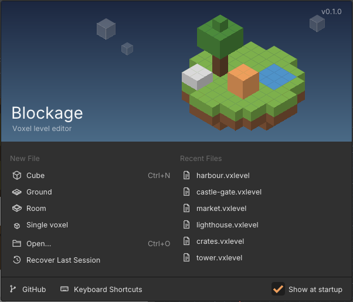

# Getting started

## Installing

Download the file for your platform from [Releases](https://github.com/koronerap/Blockage/releases).
None of them needs .NET installed.

| Platform | How |
|---|---|
| Windows 10 or 11, x64 | Unzip and run `Blockage.exe`. The build is not code-signed yet, so SmartScreen may stop it the first time: choose **More info › Run anyway**. |
| macOS 14 or later, Apple Silicon | Unzip and open `Blockage.app`. Until it is notarized, clear the download quarantine first with `xattr -dr com.apple.quarantine Blockage.app`. |
| Linux, x64 | Unpack and run `./Blockage`. `./install.sh` puts it in your applications menu, and `./install.sh --remove` takes it out again. |

Blockage needs a graphics card with OpenGL 3.3.

## The welcome screen

Blockage opens on a welcome screen:

- **New File** starts a level from a template: a white cube to extrude from, a ground, a room, a
  single voxel, or nothing at all.
- **Open...** opens a `.vxlevel`. **Take the Tour** walks through the basics on a fresh cube.
- **Recover Last Session** brings back the level as it was when Blockage last closed, even if you
  told it not to save.
- **Recent Files** are on the right, and under them the **Samples**: an island, a village and a cave
  to look round and take apart.

**Help › Welcome Screen** brings it back.

## The window

- The **menu bar** is at the top. **F3** searches every command by name.
- The **header** under it holds the mode (Object or Edit), the tool's options, and on the right the
  gizmos, overlays, X-Ray and shading.
- The **tools** run down the left side: Select, Transform, Extrude, Paint, Sculpt and Measure, and
  under them the colour you paint with.
- The **Outliner** is at the top right, listing every object, light and camera. Click one to select
  it.
- **Properties** are under the Outliner, in tabs: the tool, the object, the palette, the world and
  its lights, and reference images.
- The **status bar** at the bottom shows what the mouse buttons do right now, and what Blockage just
  did.

## Moving round the view

| Do | To |
|---|---|
| Middle drag | orbit |
| Shift + middle drag | pan |
| Wheel, or Ctrl + middle drag | zoom |
| Right drag, with W A S D and Q E | look round and fly |
| Home | frame the whole level |
| F | frame the object you are working on |
| Numpad 1, 3, 7 | look from the front, right or top; with Ctrl, from the opposite side |
| Numpad 5 | switch between perspective and orthographic |

The number keys along the top of the keyboard do the same as the numpad. **Z** opens a pie menu of
shadings, and **\`** one of views.

## Saving

**Ctrl+S** saves the level as a `.vxlevel` file, and **Ctrl+Shift+S** saves it under another name.
Blockage also saves your work in the background. If it ever closes without warning, it offers the
work back the next time it starts.

Several levels can be open at once, each in its own tab. **Ctrl+Tab** moves between them, and copy
and paste work from one to another.

## New versions and problems

- When a newer Blockage is out, the welcome screen and the **Help** menu say so. Blockage asks
  GitHub once as it starts, and sends nothing else. **Preferences › Startup › New versions** turns
  the check off.
- If Blockage crashes, the next time it starts it offers to report it. **Report on GitHub** opens
  GitHub's bug form with the version and the crash log's account filled in, for you to read over
  before you send it. Nothing is sent unless you send it.
- **Help › Report a Problem** opens the same form at any time.
